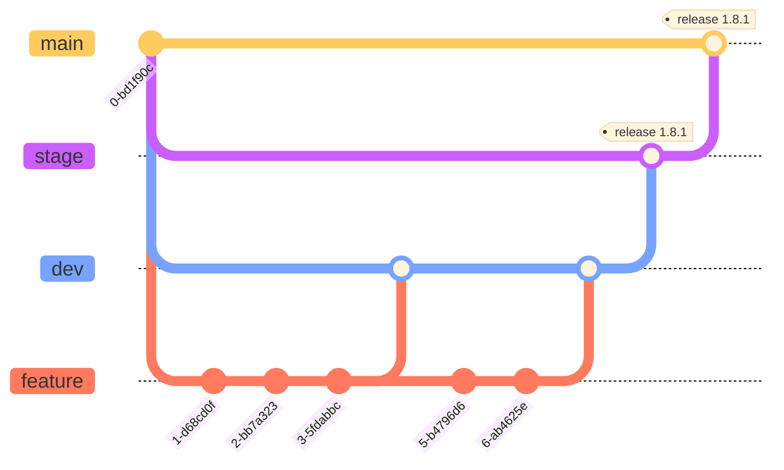

# Apollo-Kotlin-QraphQL-Jetpack

# Git workflow

```mermaid
%%{init: { 'logLevel': 'debug', 'theme': 'base', 'gitGraph': {'showBranches': true, 'showCommitLabel':true}} }%%
      gitGraph
      commit
      branch stage order: 1
      branch dev order: 2
      branch feature order: 3
      commit
      commit
      commit
      checkout dev
      merge feature
      checkout feature
      commit
      commit
      checkout dev
      merge feature
      checkout stage
      merge dev tag:"release 1.8.1"
      checkout main
      merge stage tag:"release 1.8.1"

```
